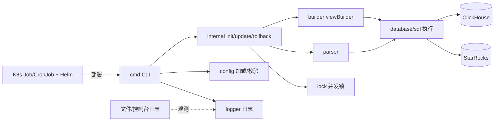
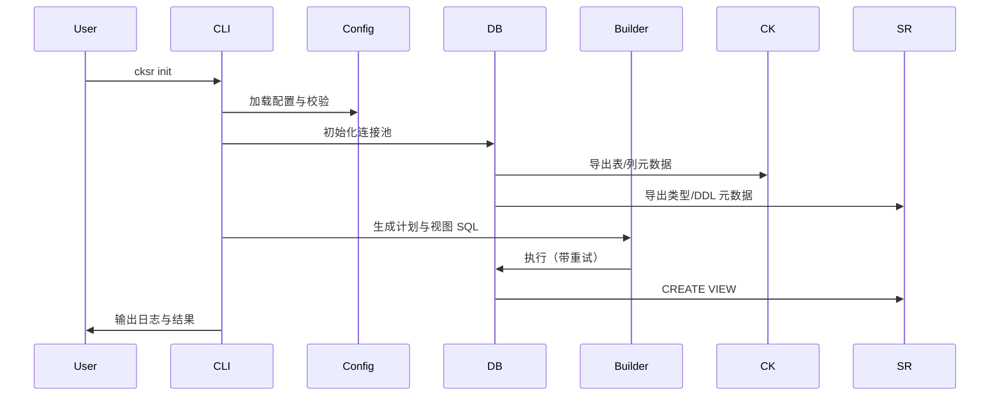
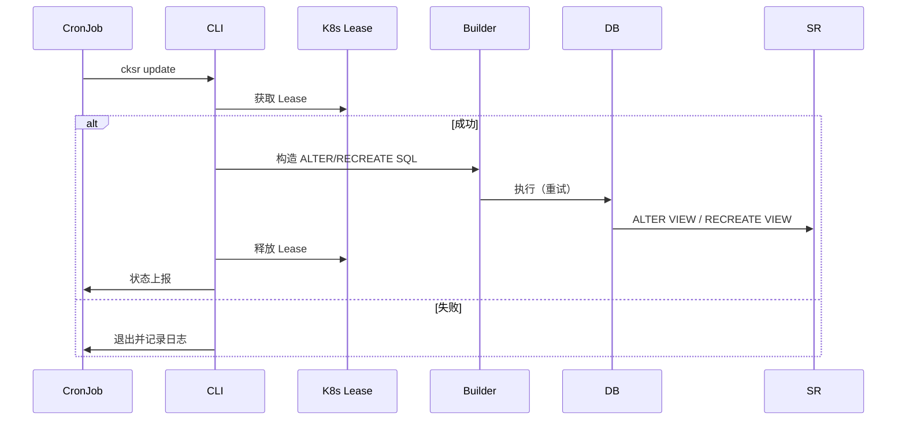
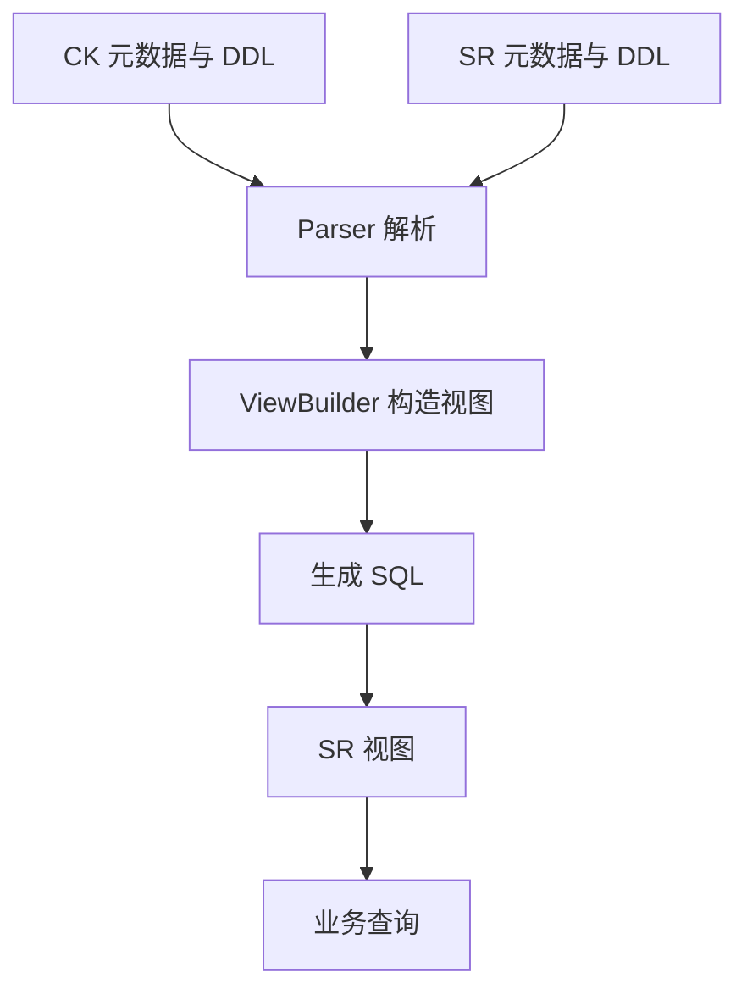

# cksr 项目设计方案

## 1. 设计概述

cksr 是一个面向 ClickHouse（CK）与 StarRocks（SR）双库的命令式治理工具。它通过生成/更新/回滚 SR 视图，结合 CK 的数据与 SR 的能力，在双库之间实现统一的查询入口与安全的架构演进。系统以 Go CLI 为形态，支持容器化与 K8s 定时任务运行。

## 2. 目标与非目标

- 目标
  - 在 CK/SR 双库间自动构建一致的视图层，支持初始化、增量更新、回滚
  - 提供稳健的重试、锁与日志体系，支撑批量治理与自动化运维
  - 可配置、可扩展，适应不同业务的字段映射与分区策略
- 非目标
  - 不引入复杂 ORM；直接基于 `database/sql` 与驱动执行
  - 不承担数据迁移/同步任务，仅关注视图与元结构治理

## 3. 技术栈与构建

- 语言与框架：Go + cobra CLI
- 数据库驱动：ClickHouse、MySQL（SR）驱动，直接 `database/sql`
- 构建与交付：`Makefile`、`Dockerfile、二进制

## 4. 系统架构与模块

- 命令层 `cmd/`
  - 解析参数、加载配置与日志、分派执行；应用日志级别与退出码
- 工作流层 `internal/*run`
  - 初始化：计划生成与表处理
  - 更新：获取并释放锁的单视图更新
  - 回滚：计划生成、执行与 Catalog 清理
- 视图构造层 `builder/`
  - 字段映射与校验、分区与时间戳策略、SQL 拼装
- 解析层 `parser/`
  - 从 SQL 文本抽取表结构与列信息
- 数据源层 `database/`
  - 连接与注册、元数据导出、执行与重试与回滚
- 配置层 `config/`
  - 结构体与默认值、严格校验与错误映射
- 基础设施
  - 日志、并发锁、重试机制

## 5. 配置设计

- 配置来源与优先级：命令行 > `config.json`
- 核心配置项
  - 数据库对：CK/SR 连接、凭据与驱动选项
  - 视图策略：视图后缀、时间戳列、分区与最小时间阈值
  - 日志：启用、路径、级别
  - 重试与超时：查询/执行退避参数、解析器超时
  - 锁与并发：实现（K8s/虚拟）、命名空间、资源名
  - 更新器：Cron 表达式、目标集合
- 加载与校验：填充默认值并进行强校验；错误映射统一退出码

## 6. 运行流程

- 初始化（`init`）
  - 加载配置→建立连接→导出 CK/SR 元数据→生成重命名/增列/CREATE VIEW 计划→构造 SQL→执行与记录
- 更新（`update`/`auto-update`）
  - 获取目标视图→获取锁→构造 ALTER/RECREATE SQL→幂等执行→释放锁
- 回滚（`rollback`）
  - 生成回滚计划→两阶段校验与执行→清理 Catalog→记录日志

## 7. 视图构建策略

- 字段映射与类型兼容
  - SR 独有字段补列；CK 侧默认值与类型兼容校验
- 分区与时间戳
  - 基于时间列与类型生成查询；拼装最终视图 SQL
- 变更策略
  - 支持 `ALTER` 与按时间分区更新

## 8. 并发与锁

- 锁实现
  - K8s Lease：集群级互斥，适配 CronJob 并发
  - 调试虚拟锁：本地单进程互斥
- 使用位置
  - 更新与回滚工作流在执行前加锁，结束后释放，避免与自动更新器冲突

## 9. 重试与容错

- 查询与执行重试：读写操作采用独立重试包装，含退避与上限
- 幂等保障：元数据校验与存在性检查降低重复执行风险；提供回滚路径兜底

## 10. 日志与观测性

- 日志输出：文件/控制台，模式（INIT/UPDATE/ROLLBACK）与级别控制
- 敏感信息：禁止记录 DSN/密码
- 

## 11. 安全设计

- 凭据管理：K8s Secret 与 Chart values 注入；本地通过环境变量或配置文件
- 最小权限：数据库用户仅授予所需 DDL/查询权限；K8s 限定 Lease/ConfigMap 资源权限

## 12. 性能与扩展

- 批量与并发：批量执行与分区更新降低锁持有时间；参数化并发度与退避策略
- 视图优化：针对时间戳与分区列进行索引/分区适配；避免非选择性过滤
- 扩展点：
  - 新字段转换策略（`builder/`）
  - 新锁实现（如 Redis）（`lock/`）
  - 可插拔重试策略（`retry/`）

## 13. 测试策略

- 集成测试：`tests/run_all.sh` 驱动；`make test` 导出二进制并运行用例；单用例 `make run-case CASE=tests/cases/02_update_with_data.sh`
- 单元测试（建议增强）：针对 `builder/`、`parser/`、`database/` 的关键函数与边界场景

## 15. 未来规划与扩展点

- 增加 `metrics` 包，导出 Prometheus 指标与事件日志
- 引入 `--dry-run` 
- 视图版本化与审计记录（追加 `auditor` 包）

## 17. 架构总览图（Mermaid）

## 18. 运行流程图（init）

## 19. 更新流程（加锁）

## 20. 数据流与视图构建

## 21. 图示说明

- 节点方块表示模块或组件，圆角/圆形表示外部系统或数据源
- 虚线连接表示部署/观测关系，实线表示调用或数据流
